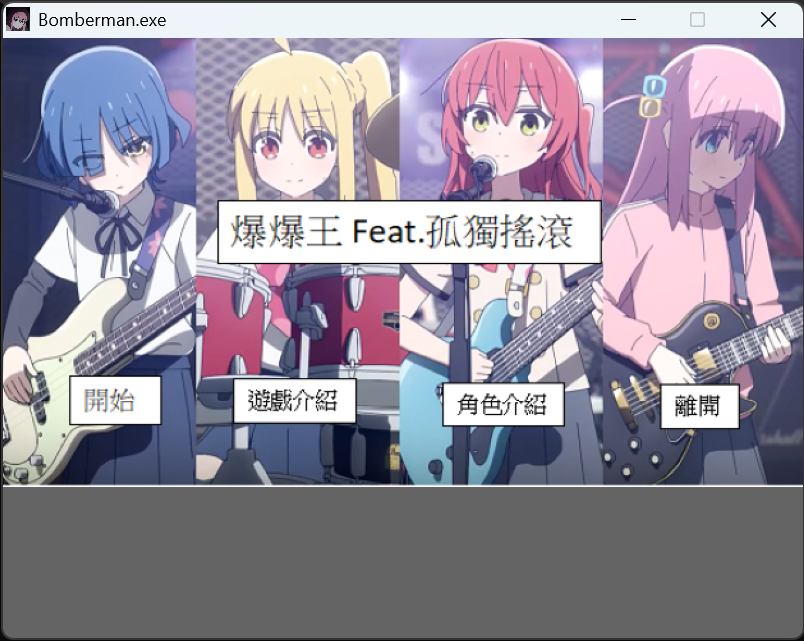
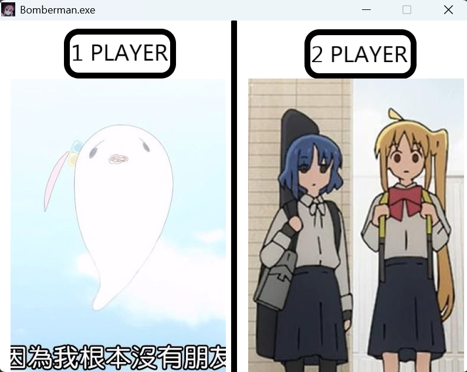
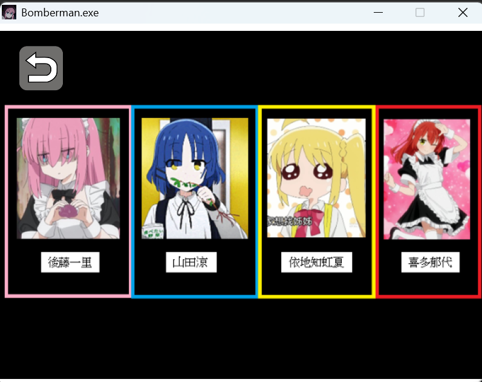
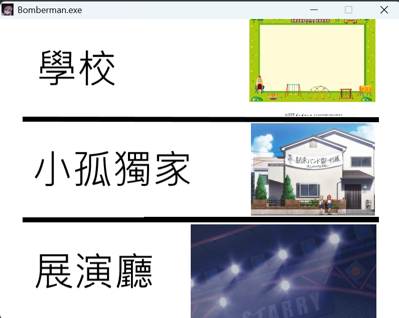

# Bomberman: Bocchi the Rock Edition

This is a single-player Bomberman-like game developed using C++ and the Allegro 5 game library, inspired by the popular anime *Bocchi the Rock!*.

Players control members of the "Kessoku Band," using their instruments as bombs to color the stage with their territory. When time runs out, the player who has covered the largest area wins!

---

## 🎮 Game Features

* **Classic Gameplay, New Twist**: Combines the traditional Bomberman mechanics with a new territory control scoring system.
* **Bocchi the Rock Theme**: Play as one of four main characters — Hitori Gotoh, Nijika Ijichi, Ryo Yamada, or Ikuyo Kita.
* **Multiplayer Battles**: Supports 1 or 2 players competing against AI-controlled opponents.
* **Varied Maps**: Includes three themed maps: School, STARRY live house, and Bocchi's Room.
* **Dynamic Environments**: Some obstacles on the map can be destroyed and may drop power-up items.
* **High Risk, High Reward**: Beware! If you're caught in an explosion — even your own — your captured territory will reset to zero!

---

## 🕹️ How to Play

### Objective

Within the time limit, use bomb explosions to color as many floor tiles as possible with your representative color. The player with the largest colored area when time is up wins.

### Controls

#### Player 1

* Move: Arrow Keys (↑ ↓ ← →)
* Place Bomb: `Space`

#### Player 2

* Move: `W A S D`
* Place Bomb: `Left Shift`

---

## 📷 Demo Images & Videos

### Screenshots

### Gameplay Video

click to open vedio

---

## 🛠️ Installation & Compilation

This project uses the Allegro 5 library. Please ensure you have a C++ compiler (e.g., GCC/G++) and Code::Blocks installed.

1. Open Code::Blocks.
2. Load the project file `BoboGame.cbp`.
3. Click Build and Run to start the game.

If you encounter any issues during installation or compilation, refer to the included guide: `tutorial/Allegro_install_i2p2.pdf`.

---

## 👨‍💻 Developers

* Chun-Yun Chang
* Po-Yu Pan
