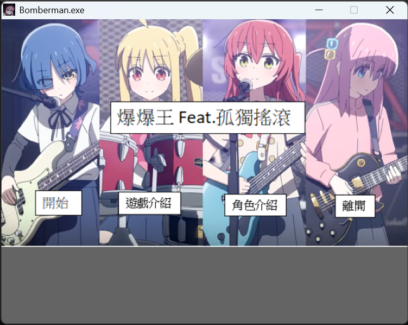
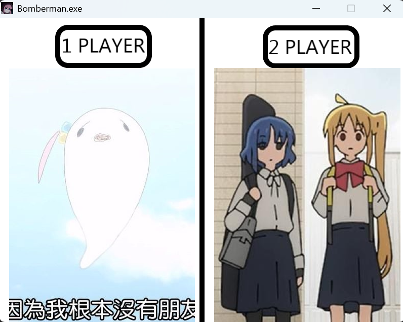
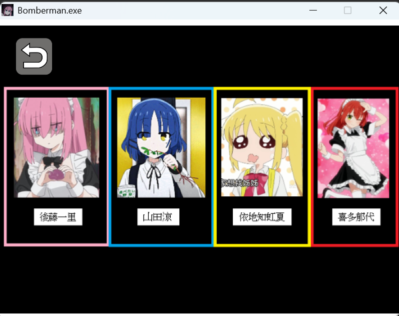

# Bomberman: Bocchi the Rock Edition

This is a single-player Bomberman-like game developed using C++ and the Allegro 5 game library, inspired by the popular anime *Bocchi the Rock!*.

Players control members of the "Kessoku Band," using their instruments as bombs to color the stage with their territory. When time runs out, the player who has covered the largest area wins!

---

## 🎮 Game Features

* **Classic Gameplay, New Twist**: Combines the traditional Bomberman mechanics with a new territory control scoring system.
* **Bocchi the Rock Theme**: Play as one of four main characters — Hitori Gotoh, Nijika Ijichi, Ryo Yamada, or Ikuyo Kita.
* **Multiplayer Battles**: Supports 1 or 2 players competing against AI-controlled opponents.
* **Varied Maps**: Includes three themed maps: School, STARRY live house, and Bocchi's Room.
* **Dynamic Environments**: Some obstacles on the map can be destroyed and may drop power-up items.
* **High Risk, High Reward**: Beware! If you're caught in an explosion — even your own — your captured territory will reset to zero!
* **🤖 Hybrid AI System**:
    * **Standard AI (Bocchi, Nijika, Ryo)**:
        * **Collision Awareness**: Intelligently navigates around obstacles.
        * **Reactive Bombing**: Targets nearby stones to clear paths and score points.
        * **Danger Evasion**: Detects active bombs and moves to safe zones.
    * **"Strong AI" (Ikuyo Kita - Player 4)**:
        * **BFS Pathfinding**: Uses Breadth-First Search to calculate the absolute shortest path to the human player.
        * **Active Hunter Logic**: Actively tracks and pursues the player across the map, rather than moving semi-randomly.
        * **Strategic Territory Expansion**: Specifically targets uncolored or opponent-controlled tiles to maximize territory gain.
        * **Obstacle Clearing**: Dynamically identifies stones blocking the shortest path to the player and bombs them strategically.
        * **Owned-Tile Awareness**: Intelligently avoids placing bombs on tiles already controlled by the AI, preventing self-disruption and territory loss.

---

## 🕹️ How to Play

### Objective

Within the time limit, use bomb explosions to color as many floor tiles as possible with your representative color. The player with the largest colored area when time is up wins.

### Controls

#### Player 1

* Move: `W A S D`
* Place Bomb: `Space`

#### Player 2

* Move: Arrow Keys (↑ ↓ ← →)
* Place Bomb: `Enter`

---

## 📷 Demo Images & Videos

### Screenshots






### Gameplay Video

click to open video
[](https://www.youtube.com/watch?v=plwuGUrNsGw)


---

## 🛠️ Installation & Compilation

This project uses the Allegro 5 library. Please ensure you have a C++ compiler (e.g., GCC/G++) and MinGW (mingw32-make) installed.

### Project Structure
* **`src/`**: Contains all source code (`.cpp`, `.h`), assets, and level configurations.
* **`allegro/`**: Allegro 5 library files (headers and libraries).
* **`Bomberman.exe`**: Generated the root directory.

### Build Instructions

#### Option 1: Using Command Line
1. Open a terminal in the project root folder.
2. Enter the `src` directory:
   ```bash
   cd src
   ```
3. Run the following command to compile:
   ```bash
   mingw32-make
   ```
4. Find the generated `Bomberman.exe` in the root directory.
5. Return to the root directory and run the game:
   ```bash
   cd ..
   ./Bomberman.exe
   ```

#### Option 2: Using VS Code
1. Open the project folder in VS Code.
2. Press **F5** to compile and run the game automatically (using the provided `.vscode` configurations which point to `src/Makefile`).

If you encounter any issues during installation or compilation, refer to the included guide: `src/tutorial/Allegro_install_i2p2.pdf`.

---

## 👨‍💻 Developers

* Chun-Yun Chang
* Po-Yu Pan
